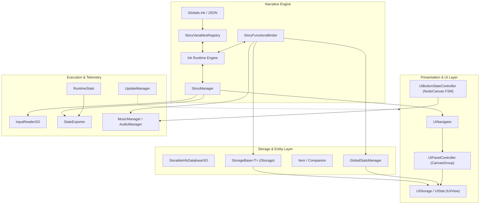
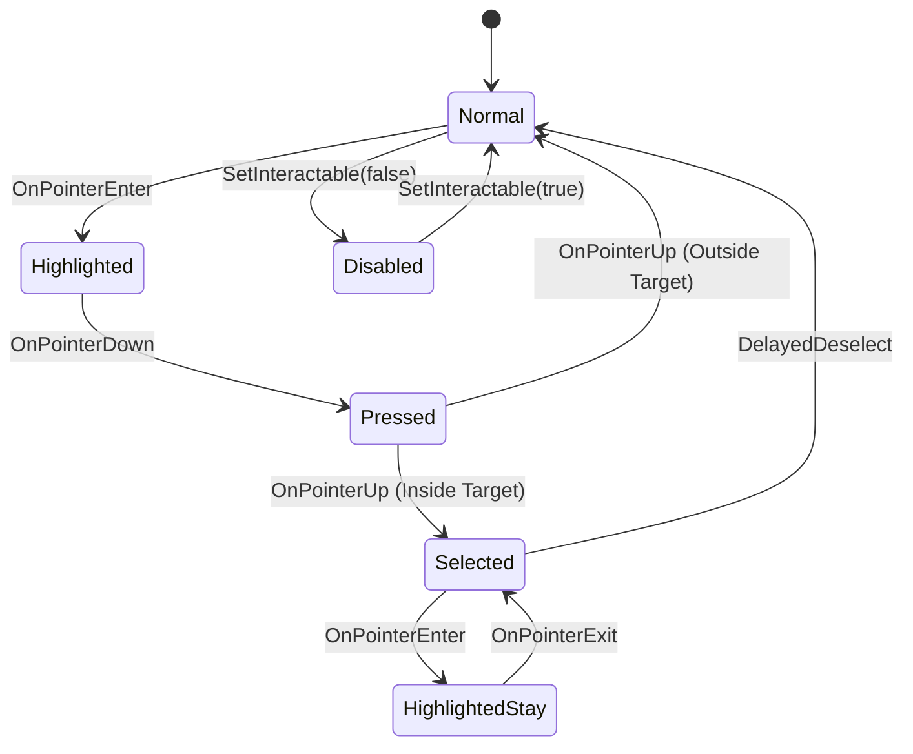

# Beyond The Line

*Beyond The Line* is a text-based interactive survival drama developed in Unity, C#, and Ink. The project was conceived and engineered as a serious game for a Master's Thesis to evaluate whether interactive narrative systems and targeted information management mechanics can foster Complex Problem Solving (CPS) cognitive abilities under systemic uncertainty and resource scarcity.

Theoretical foundations, experimental protocols, psychometric evaluation methodologies based on the CPS-GFC framework, and empirical findings are documented in the Master's Thesis.

🔗 **Visit the [Releases](https://github.com/giulio-arecco/beyond-the-line/releases) section to download the Thesis PDF and the compiled game executable.**

---

## Table of Contents

- [Beyond The Line](#beyond-the-line)
  - [Table of Contents](#table-of-contents)
  - [Architectural Overview](#architectural-overview)
  - [Core Execution Pipeline](#core-execution-pipeline)
    - [Centralized Update Managers](#centralized-update-managers)
    - [Global Stats and Reflection Mutators](#global-stats-and-reflection-mutators)
    - [Scene Lifecycle Management](#scene-lifecycle-management)
  - [Unity-Ink Interoperability](#unity-ink-interoperability)
    - [Centralized Story Orchestration](#centralized-story-orchestration)
    - [Variable Registry and State Persistence](#variable-registry-and-state-persistence)
    - [Bidirectional C# to Ink Function Binding](#bidirectional-c-to-ink-function-binding)
    - [Narrative Branch Scheduling and Camp Events](#narrative-branch-scheduling-and-camp-events)
  - [Entity \& Storage Architecture](#entity--storage-architecture)
    - [Generic Covariant Interface Hierarchy](#generic-covariant-interface-hierarchy)
    - [Collection Implementation and Sorting Strategy](#collection-implementation-and-sorting-strategy)
    - [Data Modeling and Inheritance](#data-modeling-and-inheritance)
    - [ScriptableObject Databases](#scriptableobject-databases)
    - [Animation Synchronization](#animation-synchronization)
  - [UI Architecture \& Presentation Systems](#ui-architecture--presentation-systems)
    - [Hierarchical Stack Navigation](#hierarchical-stack-navigation)
    - [Model-View-Controller Implementation](#model-view-controller-implementation)
    - [FSM-Driven UI Button State Controller](#fsm-driven-ui-button-state-controller)
    - [Type-Agnostic Storage Views](#type-agnostic-storage-views)
    - [Reactive HUD Stat Interpolation](#reactive-hud-stat-interpolation)
  - [Audio Subsystem](#audio-subsystem)
    - [Dual-Channel Crossfading Engine](#dual-channel-crossfading-engine)
    - [Debounced UI Audio Player](#debounced-ui-audio-player)
  - [Telemetry \& Behavioral Analytics Pipeline](#telemetry--behavioral-analytics-pipeline)
    - [CPS Metric Taxonomy](#cps-metric-taxonomy)
    - [Zero-Allocation Static Metric Arrays](#zero-allocation-static-metric-arrays)
    - [Session Statistics Serialization](#session-statistics-serialization)
  - [Auxiliary Utilities \& Engine Extensions](#auxiliary-utilities--engine-extensions)
    - [Singleton Implementations](#singleton-implementations)
    - [Inspector Interface Serialization](#inspector-interface-serialization)
    - [Ink Compilation Synchronization](#ink-compilation-synchronization)
  - [Dependencies \& Omitted Assets](#dependencies--omitted-assets)
    - [Third-Party Plugins](#third-party-plugins)
  - [License](#license)

---

## Architectural Overview

The software architecture is engineered around an event-driven, decoupled system topology. The engine separates data persistence, logic processing, presentation, and telemetry collection across specialized boundaries:



The system minimizes runtime coupling through the following design patterns:
- **Observer Pattern:** Implemented in `UpdateManager`, `StoryVariablesRegistry`, `GlobalStats`, and `IStorage`.
- **Model-View-Controller (MVC):** Strict separation between data containers (`StorageBase<T>`, `GlobalStats`), presentation views (`UIStorage`, `UIStat`), and state mediators (`UIPanelController`, `StoryManager`).
- **Finite State Machine (FSM):** Component-level state modeling for UI interactive elements using NodeCanvas FSM graphs.
- **Dirty-Flag Caching:** Deferred sorting of inventory collections upon read operations.
- **Type Erasure / Covariance:** Safe rendering of heterogeneous entities across uniform presentation view slots via `IStorage` and `IStorage<out T>`.

---

## Core Execution Pipeline

### Centralized Update Managers

To circumvent the native-to-managed code interop overhead incurred by multiple individual `MonoBehaviour.Update()` invocations, the codebase concentrates engine ticks into three centralized managers:
- `UpdateManager.cs`: Governs standard frame logic.
- `FixedUpdateManager.cs`: Governs physics and fixed-timestep calculations.
- `LateUpdateManager.cs`: Governs post-update presentation synchronization.

Each manager derives from `PersistentSingleton<T>` and implements an observer registration pattern. Observers implement `IUpdateObserver.cs`, `IFixedUpdateObserver.cs`, or `ILateUpdateObserver.cs`, defining a numeric priority property:

```csharp
public interface IUpdateObserver {
    int UpdatePriority { get; }
    void ObservedUpdate();
}
```

```csharp
public class UpdateManager : PersistentSingleton<UpdateManager> {
    private readonly List<IUpdateObserver> _observers = new();
    private readonly List<IUpdateObserver> _pendingObservers = new();
    private int _currentIndex;
    private bool _hasPendingObservers;

    public void Update() {
        if (_hasPendingObservers) {
            _observers.AddRange(_pendingObservers);
            _pendingObservers.Clear();
            _hasPendingObservers = false;
            _observers.Sort((a, b) => b.UpdatePriority.CompareTo(a.UpdatePriority));
        }

        for (_currentIndex = _observers.Count - 1; _currentIndex >= 0; _currentIndex--) {
            _observers[_currentIndex].ObservedUpdate();
        }
    }
}
```

Key engineering decisions implemented in this dispatcher include:
- **Deferred Registration Buffer:** New observers are appended to `_pendingObservers` rather than mutating `_observers` mid-iteration, preventing collection modification exceptions.
- **Priority Sorting:** Observers are sorted in descending priority order whenever pending items flush.
- **Reverse Iteration with Index Correction:** Traversal runs backwards from `Count - 1` to `0`. If an observer unregisters during its own or a subsequent tick, `Unregister()` adjusts `_currentIndex` when the removed element precedes the active pointer, eliminating skipped updates.

### Global Stats and Reflection Mutators

Player attributes (`Health`, `Fatigue`, `Cohesion`) are managed by `GlobalStatsManager.cs` via encapsulated `IntStat` models within `GlobalStats`. Each `IntStat` enforces value clamping between configurable boundaries (`MinValue`, `MaxValue`) and fires `OnValueChanged(int oldValue, int newValue)` delegates upon state modifications:

```csharp
public class IntStat {
    public readonly int MinValue, MaxValue;
    private int _value;
    public int Value {
        get => _value;
        set {
            var newValue = Mathf.Clamp(value, MinValue, MaxValue);
            var oldValue = _value;
            if (_value == newValue) return;
            _value = newValue;
            OnValueChanged?.Invoke(oldValue, _value);
        }
    }
    public event Action<int, int> OnValueChanged;
}
```

To enable dynamic modifications directly from Ink narrative branches without hardcoding repetitive switch-case methods, `GlobalStats` employs reflection in `GetStatValue`, `IncreaseStatValue`, and `DecreaseStatValue`. The target property is resolved by string name, cast to `IntStat`, and adjusted by the boxed numeric delta.

`GlobalStatsManager` also subscribes directly to the player inventory events (`OnAdd`, `OnRemove`). When an item with defined `IntStatModifier` structures enters or leaves the storage, `GlobalStatsManager` applies or reverts the stat deltas automatically.

### Scene Lifecycle Management

- `SceneInitializer.cs`: Executes on scene startup, locking `QualitySettings.vSyncCount = 1` to synchronize frame generation with the display refresh rate and activating the global `InputReaderSO`.
- `SceneLoader.cs`: A `PersistentSingleton<SceneLoader>` executing single-mode scene loading via `SceneManager.LoadScene`, notifying observers via `UnityEvent` hooks prior to transition execution.
- `ApplicationQuitter.cs`: Manages termination, conditionally bridging `EditorApplication.isPlaying = false` in development builds and `Application.Quit()` in standalone distributions.

---

## Unity-Ink Interoperability

The narrative subsystem integrates the compiled Ink runtime into Unity's component architecture, managing dialogue progression, state synchronization, and script-to-engine logic execution.

### Centralized Story Orchestration

`StoryManager.cs` acts as the operational orchestrator for all active stories. It exposes `EnterStory(TextAsset inkJson)` and controls flow through an internal instance of Ink's `Story` object.

Key mechanisms engineered in `StoryManager`:
- **Linear Typewriter Tweening:** Text rendering uses DOTween (`DOTween.To`) to interpolate `TextMeshProUGUI.maxVisibleCharacters` from zero to total character count at a constant rate (`duration = text.Length / speed`). If player input fires during active animation, `SkipTypingAnimation()` completes the tween instantaneously.
- **Lookahead Logic Parser (`LookAheadForLogicOrText`):** Ink scripts frequently evaluate variable branches or assignments between dialogue lines. If a line yields empty whitespace or resolves logic internally, the engine advances until non-empty narrative text or active choices emerge, avoiding dead frames in dialogue progression.
- **Custom Markup Extraction:** Translates custom non-standard markup tags (such as `<nl>`) into standard linefeed escape sequences prior to rendering.
- **Protected Layer Registration:** When narrative execution commences, `StoryManager` places its dialogue panel onto the protected background tier of `UINavigator`, safeguarding the dialogue view from being dropped by transient layer pops.

### Variable Registry and State Persistence

Ink instances discard variable memory upon story termination. To persist state across sequential acts, chapters, and optional dialogues, `StoryVariablesRegistry.cs` maintains a persistent cache of global narrative state:

1. **Bootstrap Initialization:** At startup, `StoryVariablesRegistry` compiles a dedicated `globalsInkJson` asset into an isolated story instance, scraping all initial variable declarations into a dictionary of `RegistryVariable` records.
2. **State Injection (`VariablesToStory`):** When `StoryManager` loads a chapter, `StoryVariablesRegistry.StartListening` iterates through the dictionary and invokes `story.variablesState.SetGlobal(key, value)` prior to story execution.
3. **Delta Interception:** Subscribes to `story.variablesState.variableChangedEvent`. When Ink mutates a variable, the registry updates its internal dictionary and invokes corresponding C# event listeners (`OnValueChanged`).
4. **Generic Evaluation Engine:** Implements `CompareVariableTo<T>` to perform type-safe condition checks (`Equal`, `NotEqual`, `Greater`, `GreaterOrEqual`, `Less`, `LessOrEqual`) between Ink unboxed values and C# primitives without throwing type mismatch exceptions.

### Bidirectional C# to Ink Function Binding

`StoryFunctionsBinder.cs` registers C# delegates with Ink's external execution table using `story.BindExternalFunction`. It exposes 16 discrete functions directly to story scripts:

| Ink External Signature | Bound C# Operation |
| :--- | :--- |
| `HasItem(itemId)` | Queries `_playerInventory.Has(itemId)`. |
| `HasCompanion(companionId)` | Queries `_playerCompanions.Has(companionId)`. |
| `AddItemToInventory(itemId)` | Resolves item via `ItemInfoDatabaseSO`, instantiates `Item`, calls `Add()`. |
| `RemoveItemFromInventory(itemId, count)` | Invokes `_playerInventory.RemoveMany(itemId, count)`. |
| `AddCompanionToParty(companionId)` | Resolves info, instantiates `Companion`, calls `CopyItemsTo(_playerInventory)`, adds companion. |
| `RemoveCompanionFromParty(companionId)` | Invokes `_playerCompanions.Remove(companionId)`. |
| `SetCompanionStat(companionId, stat, val)` | Updates `Companion.Health` or `Companion.Hunger`. |
| `GetCompanionStat(companionId, stat)` | Reads `Companion.Health` or `Companion.Hunger`. |
| `GetGlobalStat(statName)` | Dynamically reflects value from `GlobalStatsManager`. |
| `IncreaseGlobalStat_Internal(stat, val)` | Increases target stat in `GlobalStatsManager`. |
| `DecreaseGlobalStat_Internal(stat, val)` | Decreases target stat in `GlobalStatsManager`. |
| `PlayMusic_Internal(id, trans, dur, vol)` | Resolves clip via `MusicLibrarySO`, instructs `MusicManager`. |
| `StopMusic_Internal(duration)` | Fades out active music sources via `MusicManager`. |
| `Log(msg)`, `LogWarning()`, `LogError()` | Routes Ink debug messages into Unity's `Debug` console. |

Upon story completion or transition, `UnbindGlobalFunctions(Story story)` unbinds every external function.

### Narrative Branch Scheduling and Camp Events

- `StoryEventTrigger.cs`: Enqueues an ordered sequence of primary story acts (`Queue<TextAsset>`), popping and running chapters sequentially.
- `OptionalStory.cs`: Encapsulates optional dialogue assets with playability flags (`IsPlayable`, `IsReplayable`).
- `CampEventTrigger.cs`: Monitors the `CAN_SET_CAMP` global Ink variable via `StoryManager.SubscribeToVariableChange`. When enabled by narrative conditions, the trigger activates the UI camp button. Upon triggering, it enqueues configured optional stories into `StoryManager` and loads the base camp dialogue.

---

## Entity & Storage Architecture

### Generic Covariant Interface Hierarchy

To prevent type ambiguity and enforce data safety across distinct game objects (items vs. companions), the storage architecture is organized around a dual-interface hierarchy:

```csharp
public interface IStorage {
    event Action<Storable> OnAdd;
    event Action<Storable> OnRemove;
    void Add(Storable element);
    void Remove(string id);
    void RemoveMany(string id, int count);
    bool Has(string id);
    bool IsEmpty();
    Storable GetElement(string id);
    IReadOnlyList<Storable> GetSortedElements();
}

public interface IStorage<out T> : IStorage where T : Storable {
    T GetTypedElement(string id);
    IReadOnlyList<T> GetSortedTypedElements();
}
```

The covariant definition (`<out T>`) allows generic storage references to be downcast safely to the base non-generic `IStorage` interface. The presentation layer interacts strictly through `IStorage`, rendering slots without requiring compile-time knowledge of concrete storage contents.

### Collection Implementation and Sorting Strategy

`StorageBase<T>.cs` provides the concrete foundation for collection management:
- **Dirty-Flag Sorting:** Rather than sorting the internal list on every insertion, `Add()` sets `_isDirty = true`. Calls to `GetSortedElements()` or `GetSortedTypedElements()` trigger `EnsureSorted()`, running `_elements.Sort()` only when dirty flags are set.
- **Batch Removal Logic:** `RemoveMany(string id, int count)` traverses the collection in reverse order, removing matched instances up to `count` while firing `OnRemove` events for each removed element.
- **Type Guarding:** `Add(Storable element)` verifies that input references conform to `T` via type checking before appending, throwing `ArgumentException` on invalid payloads.

### Data Modeling and Inheritance

Entities derive from an abstract base class hierarchy:
- `Storable.cs`: Abstract base class implementing `IComparable<Storable>`, providing identity comparison by string identifier (`Info.id`).
- `Storable<TInfo>.cs`: Generic abstract wrapper exposing strongly typed metadata `TInfo` derived from `StorableInfoSO`.
- `Item.cs`: Represents discrete inventory items carrying `ItemInfoSO` configurations.
- `Companion.cs`: Models companions. Features dedicated `Health` (0–100) and `Hunger` (0–100) variables with event dispatchers (`OnHealthChanged`, `OnHungerChanged`). Implements `CopyItemsTo(IStorage<Item> storage)` to deposit personal items into the player inventory upon recruitment.

### ScriptableObject Databases

Entity configurations are defined as immutable assets:
- `StorableInfoSO.cs`: Abstract asset holding identification metadata (`id`, `entityName`, `description`, `sprite`).
- `ItemInfoSO.cs`: Contains an array of `IntStatModifier` structs, automatically sorted by stat name on asset enable.
- `CompanionInfoSO.cs`: Contains an array of default `Item` entries assigned to the companion upon party recruitment.
- `StorableInfoDatabaseSO<T>.cs`: Abstract generic repository mapping assets into a fast internal `Dictionary<string, T> _lookup`. Initialized lazily on first access, returning assets by string identifier in *O(1)* time complexity. Concrete implementations include `ItemInfoDatabaseSO` and `CompanionInfoDatabaseSO`.

### Animation Synchronization

`StorageAddEffects.cs` coordinates notification badges when inventory or companion contents expand while panels are closed. It monitors `storage.Value.OnAdd` and triggers a DOTween animation component (`tweener.DOPlay()`).

If multiple storage panels are queued, `StorageAddEffects` synchronizes pulse animations by reading elapsed tween durations across a defined `syncGroup` (`otherAnim.tween.Elapsed()`), snapping the new tween to the exact playback offset (`Goto(syncTime)`) to ensure synchronous visual pulsing.

---

## UI Architecture & Presentation Systems

### Hierarchical Stack Navigation

Screen flow is coordinated by `UINavigator.cs`, utilizing a two-dimensional list architecture `List<List<UIPanelController>> _layers`:
- **Protected Base Layer (`_layers[0]`):** Retains persistent screen surfaces (HUD elements, dialogue panels) that must remain active during transient UI modal states.
- **Active Navigation Stack:** Manages stacked layers of panels.
- **Push Strategies:** `PushUILayer` accepts `UILayerPushOptions`:
  - `None`: Retains existing layers in the background stack.
  - `RemovePreviousLayer`: Drops the immediate preceding layer.
  - `RemoveAllPreviousLayers`: Clears all transient layers back to the protected base.
- **Pop Restoration:** `PopUILayer()` hides the current active top layer, pops it from the stack, and restores visibility and interactivity to the underlying layer.

### Model-View-Controller Implementation

The presentation pipeline enforces an MVC pattern:
- **Model:** `StorageBase<T>`, `GlobalStats`.
- **View:** Components implementing `IUIView.cs` (`UIStorage.cs`, `UIStat.cs`).
- **Controller:** `UIPanelController.cs`.

`UIPanelController` attaches to a `CanvasGroup` and identifies all child views (`GetComponentsInChildren<IUIView>(true)`). Calling `SetVisibleAndInteractable(bool visible)` toggles alpha (`1.0f` vs. `0.0f`), `interactable`, and `blocksRaycasts` without deactivating game objects. This avoids costly hierarchy reconstruction overhead and invokes `view.OnViewShow()` or `view.OnViewHide()` across child views to refresh presentation data passively.

```csharp
public static void SetVisibleAndInteractable(this CanvasGroup canvasGroup, bool visibleAndInteractable) {
    if (canvasGroup == null) return;
    canvasGroup.alpha = visibleAndInteractable ? 1f : 0f;
    canvasGroup.interactable = visibleAndInteractable;
    canvasGroup.blocksRaycasts = visibleAndInteractable;
}
```

### FSM-Driven UI Button State Controller

Standard Unity `Selectable` transitions cannot represent complex compound navigation states (such as staying selected during pointer release or resolving external gamepad deselection delays). `UIButtonStateController.cs` bridges Unity UI events with an embedded NodeCanvas Finite State Machine (`FSMOwner`):



Key edge cases resolved by this controller:
- **Frame-Zero Ghost Selection:** When panels activate, the Unity EventSystem often pushes auto-selection events within the same frame. The controller records `_enableFrame = Time.frameCount`. Any selection triggered on `_enableFrame` is rejected.
- **Drag-Release Cancellation:** Records whether the pointer was down over the object via `_wasSelectedBeforeClick`. Releasing the pointer outside the object boundary cancels the pending selection state.
- **Delayed Deselection Coroutine (`DelayedDeselect`):** When the EventSystem signals a deselect event while the primary mouse button is held, deselection is deferred until `!inputReader.IsLmbPressed`. The coroutine waits an additional frame; if the subsequent selected object is null, it reclaims selection focus.
- **Event Forwarding:** State entries and exits fire strongly typed `UltEvent` callbacks (`onHighlightEnter`, `onSelectEnter`, `onSubmit`), routing cleanly to audio triggers and custom animations.

### Type-Agnostic Storage Views

`UIStorage.cs` implements `IUIView`, populating pre-allocated `UIStorageSlot` elements dynamically:
1. When `UIPanelController` invokes `OnViewShow()`, `UIStorage` fetches the elements via `storage.Value.GetSortedElements()`.
2. For each element, it instantiates a `UIStorageElement` prefab, parents it to the next empty `UIStorageSlot`, and applies sizing via `AspectRatioFitter` based on sprite dimensions.
3. Decouples entity text formatting via `IStorableTextWriter.cs`:
   - `UIItemsText.cs`: Renders item names, descriptions, and dynamic stat modifiers into `LabelValueTextFields` arrays.
   - `UICompanionsText.cs`: Renders companion biographical info alongside live health and hunger bars.

### Reactive HUD Stat Interpolation

`UIStatsHandler.cs` and `UIStat.cs` monitor player vitals. When `GlobalStats` values change, `UIStat.UpdateTextAnimated` triggers a coordinated DOTween sequence:
- A scale punch (`DOPunchScale`) to highlight the modified element.
- Numeric rolling interpolation (`DOTween.To`) updating text from `oldVal` to `newVal`.
- Color flashing against positive or negative event themes using an evaluated `statColorGradient`.

---

## Audio Subsystem

### Dual-Channel Crossfading Engine

`MusicManager.cs` implements a ping-ponging dual audio source architecture (`sourceA`, `sourceB`) to eliminate audio clipping during music transitions:

```csharp
public class MusicManager : PersistentSingleton<MusicManager> {
    [SerializeField] private AudioSource sourceA;
    [SerializeField] private AudioSource sourceB;
    private Sequence _currentTransition;
    private bool _isSourceAPlaying;
    // ...
}
```

Transitions are parameterized through `AudioTransitionType`:
- `None`: Cleans up the active source and plays the new track instantly on the standby source.
- `FadeIn`: Cleans up the active source and fades the incoming track from 0 to target volume (`Ease.OutQuad`).
- `CrossFade`: Joins both sources in a synchronized DOTween sequence, fading out the active source (`DOFade(0)`) while fading in the new track (`DOFade(endVolume)`).
- `FadeOutIn`: Chains sequential tweens, fading out the active track, inserting an optional silence interval (`defaultFadeOutInSilenceGap`), and fading in the new clip.

Tracks are cataloged in `MusicLibrarySO.cs`, which provides cached dictionary lookups by string identifier.

### Debounced UI Audio Player

`AudioManager.cs` manages one-shot user interface sound effects:
- **Double-Precision Debouncing:** Measures elapsed time against `Time.realtimeSinceStartupAsDouble`. Clicks arriving within `minTimeBetweenClicks` (default 50ms) are discarded, preventing sound stacking during rapid keyboard navigation.
- **Pitch Randomization:** Adjusts `uiSource.pitch` by `originalPitch + Random.Range(-pitchVariance, pitchVariance)` before playback, preventing auditory fatigue during repeated menu interactions.

---

## Telemetry & Behavioral Analytics Pipeline

### CPS Metric Taxonomy

The project integrates a comprehensive behavioral telemetry pipeline built to evaluate Complex Problem Solving (CPS) competencies. Metrics are logged continuously throughout the narrative flow and gameplay interactions:

| Competency Dimension | Primary Tracked Variables |
| :--- | :--- |
| **Information Gathering & Exploration** | `CPS_Radio_Tried_Blind`, `CPS_Radio_Tried_No_Manual`, `CPS_Radio_Solved_Systematic`, `CPS_Radio_Broken`, `CPS_Lira_Clues_Found_Count`, `CPS_Lira_Unmasked_Success`, `CPS_Info_Points_Gathered`. |
| **Strategic Planning & Risk Assessment** | `CPS_Route_Discovered_Mountain`, `CPS_Route_Chosen_Road`, `CPS_Route_Chosen_Mountain`, `CPS_Route_Was_Prepared`, path-specific risk flags (Sewer vs. Warehouse, Bridge vs. Tunnel). |
| **Resource Allocation & Scarcity Management** | `CPS_Camp_Used_Rations`, `CPS_Camp_Used_Bandages`, `CPS_Camp_Used_Medikits`, `CPS_Found_*` resource acquisition flags, `CPS_Min_Health_Value`, `CPS_Max_Fatigue_Value`. |
| **Social Dynamics & Team Preservation** | `CPS_Elias_Recruited`, `CPS_Elias_Died_Sacrifice`, `CPS_Elias_Died_Separation`, `CPS_Elias_Bridge_Fall`, `CPS_Lira_Recruited`. |
| **Interface Behavioral Interaction** | `CPS_Opened_Inventory_Count`, `CPS_Opened_Companions_Count` (tracked via `UIPanelControllerShowedTracker.cs`). |

### Zero-Allocation Static Metric Arrays

Engine-level gameplay actions are recorded through `RuntimeStats.cs`. To avoid memory allocations and garbage collection overhead during gameplay loops, metrics are maintained within fixed-size static primitive arrays dimensioned by enum limits:

```csharp
public static class RuntimeStats {
    private static readonly int[] IntStats = new int[(int)IntRuntimeStat.Count];
    private static readonly float[] FloatStats = new float[(int)FloatRuntimeStat.Count];
    private static readonly bool[] BoolStats = new bool[(int)BoolRuntimeStat.Count];
    private static readonly string[] StringStats = new string[(int)StringRuntimeStat.Count];

    public static void SetStat(IntRuntimeStat stat, int value) => IntStats[(int)stat] = value;
    public static int GetStat(IntRuntimeStat stat) => IntStats[(int)stat];
    public static void IncreaseStat(IntRuntimeStat stat, int amount) => IntStats[(int)stat] += amount;
    // ...
}
```

Reading or updating stats requires a direct array index access (*O(1)* complexity) with zero heap allocation.

### Session Statistics Serialization

`EndOfGameHandler.cs` listens for narrative completion via `StoryManager.OnStoryExit`. When `END_OF_STORY` resolves to `true`:
1. Disables gameplay input actions via `inputReader.DisableInputActionMap("Gameplay")`.
2. Activates the final ending UI screen via `UINavigator.PushUILayer(endOfGamePanel)`.
3. Harvests all narrative variables prefixed with `"CPS"` from `StoryVariablesRegistry`.
4. Combines narrative variables with the runtime gameplay dictionary returned by `RuntimeStats.GetAllStatsAsDictionary()`.
5. Dispatches the combined payload to `StatsExporter.SaveGameStats()`, which serializes the session into formatted JSON and saves it under `SessionStats/session_stats_{index}.json` for empirical thesis evaluation.

---

## Auxiliary Utilities & Engine Extensions

### Singleton Implementations

The architecture provides three distinct singleton patterns under the `Utils` namespace:
- `Singleton<T>`: Scene-scoped instance. If not found in the active scene, instantiates a new GameObject dynamically (verifying that no serialized inspector fields are present via reflection in `SerializeFieldChecker`).
- `PersistentSingleton<T>`: Cross-scene instance invoking `DontDestroyOnLoad(instance)` and automatically detaching itself from parent transforms on awake.
- `RegulatedSingleton<T>`: Self-regulating singleton where newer instances replace older instances based on instantiation timestamps (`InitializationTime = Time.time`).

### Inspector Interface Serialization

Unity cannot serialize native C# interfaces in the Inspector. To maintain strict interface-based decoupling without relying on concrete `MonoBehaviour` field references, the project implements a custom serialization bridge:

- `InterfaceReference<TInterface, TObject>`: A serializable class wrapping an underlying `UnityEngine.Object` reference, exposing a strongly typed `Value` getter that casts the target to `TInterface`.
- `RequireInterfaceAttribute.cs`: A property attribute paired with custom property drawers (`InterfaceReferenceDrawer.cs`, `RequireInterfaceDrawer.cs`) validating drag-and-drop assignments in the Inspector to ensure the assigned component implements `TInterface`.

### Ink Compilation Synchronization

`InkRecompiler.cs` provides an editor utility under `Tools/Ink/Force Recompile All Ink Files`. It iterates across all `.ink` source files within the project, wraps compilation within `AssetDatabase.StartAssetEditing()` and `AssetDatabase.StopAssetEditing()`, and enforces synchronous re-importing via `AssetDatabase.Refresh(ImportAssetOptions.ForceSynchronousImport)` to guarantee clean asset builds prior to game deployment.

---

## Dependencies & Omitted Assets

While this repository contains the complete custom source code and the original narrative framework developed for the thesis, **all graphical, audio, and proprietary third-party assets have been intentionally excluded.** This decision was made to comply with third-party EULAs and to avoid licensing ambiguities regarding AI-generated media.

Because these assets and references are omitted, **the project is not fully playable or operational within the Unity Editor** directly from a clone.

### Third-Party Plugins
If you wish to inspect the project structure in the Editor, please note that the original development relied on the following third-party plugins:

* [**NodeCanvas**](https://assetstore.unity.com/packages/tools/visual-scripting/nodecanvas-14914) by *ParadoxNotion* (Expected path: `Assets/ParadoxNotion/`)
* [**Scene Attribute**](https://assetstore.unity.com/packages/tools/utilities/scene-attribute-reference-scenes-in-inspector-316227) by *Agent40* (Expected path: `Assets/SceneAttribute/`)
* [**UltEvents**](https://assetstore.unity.com/packages/tools/gui/ultevents-111307) by *Kybernetik* (Expected path: `Packages/com.kybernetik.ultevents/`)
* [**DOTween Pro**](https://assetstore.unity.com/packages/tools/visual-scripting/dotween-pro-32416) by *Demigiant* (Expected path: `Assets/Plugins/Demigiant/`)

🔗 **To experience the game, please download the compiled executable available in the [Releases](https://github.com/giulio-arecco/beyond-the-line/releases) section.**

---

## License

This project uses a dual-license structure to separate the software infrastructure from the creative narrative content:

* **Source Code:** All C# scripts, engine configurations, and source code are licensed under the [MIT License](LICENSE).
* **Narrative Assets:** The story, characters, dialogues, and Ink script files are licensed under the [Creative Commons Attribution-NonCommercial 4.0 International (CC BY-NC 4.0)](Assets/Story/LICENSE-NARRATIVE).

You are free to use, modify, and build upon the source code for any purpose, provided you include the original copyright notice. However, the narrative content of *Beyond The Line* cannot be used for commercial purposes without explicit permission.
